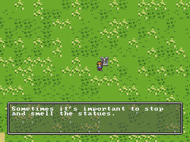

This is a very simple tester for null0 tiled map API.

I create a game-map style `adventure_map.h`, and a little user-code to define what happens, which could be lightly modified to do some other style (like SMB) then things are defined as objects in the [Tiled](https://www.mapeditor.org/) maps.



I am using [this fork of pntr_tiled](https://github.com/RobLoach/pntr_tiled/pull/24) that has external tilesheets and better object-support.

```sh
# build native
cmake -B build
cmake --build build

# build web
emcmake cmake -B wbuild
cmake --build wbuild

# web-server
npx -y live-server docs

# auto-reload build (in another terminal)
watch 'cmake --build wbuild
```

## collisions

Add a couple object-layers to your map:

- `objects` - put the player & anything they interact with here. Collision is per-tile-square.
- `collisions` - put collisions-shapes that make up the "solid things" in your world here. The player will not be able to walk to these areas.